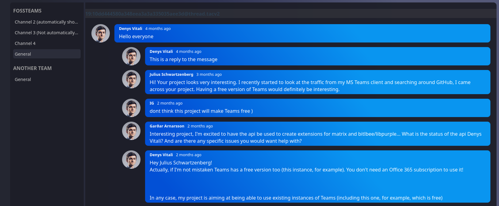
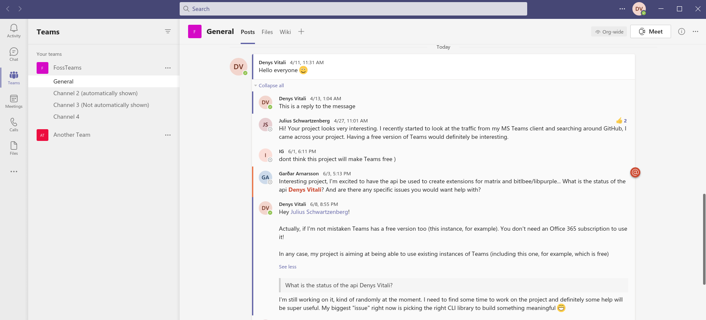

# fossteams-frontend

An open source frontend for Microsoft Teams, based on [fossteams-backend](https://github.com/fossteams/fossteams-backend)

## Screenshots

### Our UI




### Microsoft Teams (for comparison)



## Description

### Goal of the project

The goal of this project is to create an alternative and lightweight
UI that only takes care of interacting with Microsoft Teams.
We try to offload as much as possible to the backend, so that the
user interface can be as lightweight as possible.

### Status of the project

The project just started, but with your contribution we can 
make it grow and finally have a good alternative client for
Microsoft Teams that is:

- fast
- privacy-focused
- open source
- customizable

## Requirements

- yarn
- [`fossteams-backend`](https://github.com/fossteams/fossteams-backend)
- A Microsoft Teams account

## Project setup
```
yarn install
```

### Compiles and hot-reloads for development
```
yarn serve
```

### Compiles and minifies for production
```
yarn build
```

### Lints and fixes files
```
yarn lint
```

### Customize configuration
See [Configuration Reference](https://cli.vuejs.org/config/).
